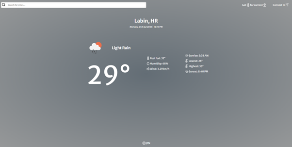

# Weather App

## Description

This is a React based Weather app using the [openweathermap API](https://openweathermap.org). The app allows the user to check the current weather conditions and forecast for any location worldwide. It's a handy tool designed to keep the user informed about the weather so they can plan their activities accordingly.

## Features

- Real-time weather information: Get the current temperature, weather conditions, humidity, wind speed, and more.
- Search by location: Enter the name of any city or location to get weather data for that area.
- Conversion from celsius to fahrenheit and vice versa
- Responsive design: Access the app on various devices, including desktops, tablets, and smartphones.

## Live demo

You can try out the Weather App by visiting the [live demo](https://weather-app-jpn.netlify.app)

## How to run the app locally

If you want to run the app localy:

#### 1. Clone the repository

- HTTPS: `git clone https://github.com/Zack1808/weather-app.git`
- SSH: `git clone git@github.com:Zack1808/weather-app.git`
- GitHub CLI: `gh repo clone Zack1808/weather-app`

#### 2. Enter the project directory

`cd weather-app`

#### 3. Allow the app to install the necessary packages (Node.js has to be installed on the device)

`npm install`

#### 4. Settup the API key

Within the project directory, create the .env file. In there create the variable REACT_APP_YT_API_KEY

`REACT_APP_OPENAI_API_KEY=yourOpenWeatherMapAPIkey`

#### 5. start the app

`npm start`

After execution, the localhost server will startup and a browser window will open, previewing the weather app.

## Contribution

Contributions to the Weather app project are welcome. If you find any issues or want to add new features, feel free to create a pull request. Make sure to follow the project's coding conventions and provide detailed information about your changes.

## Contact

If you have any questions or suggestions, you can reach me via:

- Mail: jeanpierrenovak23@gmail.com
- My portfolio: [jeanpierrenovak.netlify.app](https://jeanpierrenovak.netlify.app)

---

Stay weather-ready!
